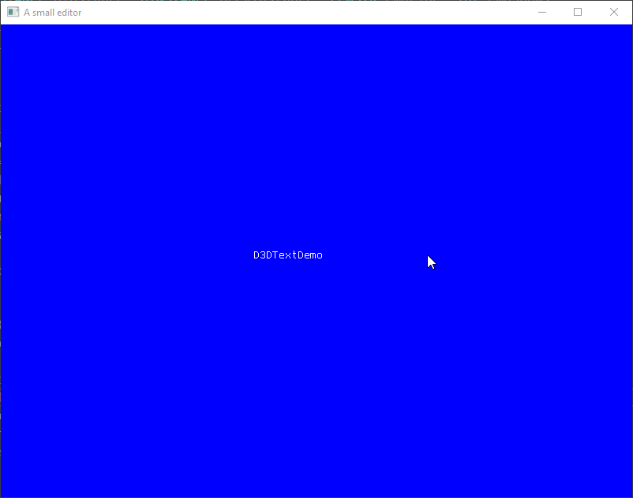

# SmallEditor

In this project I was learning about DirectX 11 and how to set it up. It waits for keyboard input and then simply draw the character. Not much more to tell really.

Tags: C++, DirectX 11, editor
